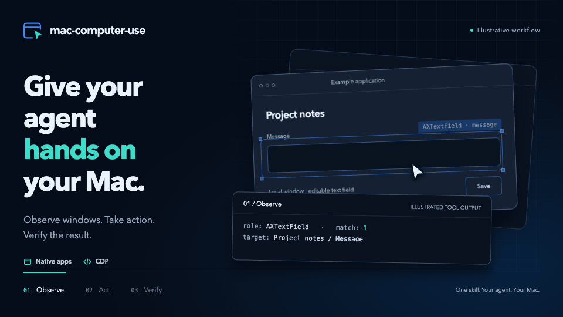
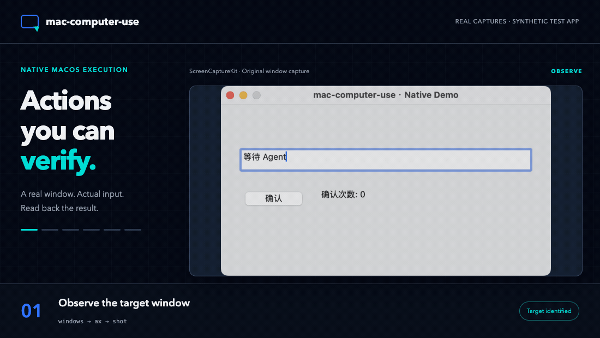

<div align="center">

<picture>
  <source media="(prefers-color-scheme: dark)" srcset="assets/mac-computer-use-logo-dark.svg">
  
</picture>

### Give your agent hands on your Mac.

Observe windows. Take action. Verify the result.

**English** · [简体中文](README.zh-CN.md)



<sub>Illustrative workflow. <a href="assets/readme-hero-poster.png">Static preview</a></sub>

[Get started](#get-started) · [Capabilities](#capabilities) · [How it works](#observe--act--verify) · [Compatibility](#one-skill-many-agents) · [Download](https://github.com/To3akaRin/mac-computer-use/releases/latest)

[](https://github.com/To3akaRin/mac-computer-use/actions/workflows/ci.yml)
[](https://github.com/To3akaRin/mac-computer-use/releases)
[](LICENSE)
[](#requirements)

</div>

Turn a desktop task into an agent workflow. **mac-computer-use** connects native Mac windows, Accessibility controls, and embedded Chromium pages to an agent that can observe a target, operate it, and check what actually happened. Built on the open [Agent Skills standard](https://agentskills.io/), it works with runtimes that can read the full skill package and execute commands on your Mac.

## From reference photos to a rotatable 3D exhibition space. 12 minutes, without touching the mouse.


**Real-world example: modeling a central exhibition space in 3D.** A central column, overhead ring, curved cabinets, portal frames, terminals, and a checkout counter form a three-dimensional space you can rotate and inspect in a browser.

**3,388 triangles · 117 meshes · a single GLB file of approximately 218 KiB.** The animation was recorded directly from the model viewer, showing the actual geometry from multiple angles. The model includes an editable Blender source file; dimensions were estimated from reference photos.

[View the full-size still](assets/showcase-3d-poster.jpg) · [Asset provenance and recording notes (Chinese)](docs/media.md)

## Get started

Install the complete skill with [Skills CLI](https://github.com/vercel-labs/skills), then select your agent:

```bash
npx skills add To3akaRin/mac-computer-use
```

Your agent needs to execute locally on a **Mac with macOS 14+ and Swift 6 Command Line Tools**. CDP commands also require **Node.js 22.4+**. See [requirements](#requirements) for permissions and setup.

Prefer a manual install? Download the skill ZIP and SHA-256 from [Releases](https://github.com/To3akaRin/mac-computer-use/releases/latest), or clone this repository and choose a confirmed skill directory:

```bash
sh scripts/install.sh --skills-dir "/path/to/your/skills" --dry-run
sh scripts/install.sh --skills-dir "/path/to/your/skills"
```

The installer copies the full `mac-computer-use/` directory and refuses to overwrite an existing installation. Keep the accompanying source files and scripts; copying only `SKILL.md` is not enough. See the [runtime installation guide (Chinese)](references/runtimes.md).

### Start with a task

```text
“Turn this reference image into a 3D model I can inspect.”

“Use this app to connect to my server and complete the deployment.
Check the result at every step.”

“Find the target window, enter this Chinese text in the specified field,
and read it back to verify it.”

“Click this button, check whether the app's state actually changed,
and capture a screenshot of the result.”
```

These are task examples for your agent to plan. What it can complete depends on the target app's controls, interfaces, permissions, and the tools available to the agent. The skill supplies desktop execution tools; your agent supplies the reasoning and orchestration.

## Capabilities

| Capability | What your agent can do |
| --- | --- |
| **See the target** | List windows, processes, titles, and geometry. Read Accessibility (AX) controls and CDP page structure. |
| **Find a control path** | Inspect application bundles, scripting dictionaries, URL schemes, and candidate debugging ports. |
| **Enter text precisely** | Set and read back AX values, send native Unicode input, and use CDP `Input.insertText` for fields and rich text. |
| **Interact with apps** | Click, hover, scroll, and send shortcuts through native input or Chromium renderer events. |
| **Use the foreground carefully** | Prefer background channels; check user inactivity, target state, and a session lock before foreground actions. Restore focus when safe. |
| **Keep coordinates grounded** | Distinguish logical points, normalized coordinates, and screenshot pixels. Reject stale or changed window snapshots. |
| **Collect evidence** | Capture windows with ScreenCaptureKit; return AX readbacks, read-only CDP assertions, and structured JSON results. |
| **Run a sequence** | Execute CDP JSON batches and stop at the first failure, refusal, or unknown result. |

**Local execution. System-native frameworks. Zero runtime npm dependencies for the CDP client.** The control tools need no hosted backend, database, or separate API key. Your agent runtime and model have their own requirements.

### Native Mac: observe, type, click, read back



The window captures come from this project's native tools driving a dedicated test app. English captions and playback pacing are presentation layers, not a timing benchmark. The app's original on-screen text is unchanged. [Static preview](assets/native-demo-en-poster.png) · [Recording notes (Chinese)](docs/media.md)

## Observe → Act → Verify

Desktop automation needs to hit the right target **and successfully determine whether the action took effect**.

| Observe | Act | Verify |
| --- | --- | --- |
| Identify the app and window. Read controls or page structure. Capture a fresh, target-bound snapshot. | Prefer existing app interfaces, then AX, then input events. Preview writes with `--dry-run` before dispatch. | Read back values or check a read-only assertion. Capture evidence. Stop if the outcome is unknown. |

The execution rules are part of the tools:

- **Preview before writing.** Write commands support `--dry-run` to check parameters and available preconditions without typing, clicking, or restarting an app.
- **Use an unambiguous target.** Ambiguous elements, stale references, and unspecified coordinate units are rejected.
- **Respect active use.** Foreground actions require at least 2 seconds of user inactivity, wait at most 15 seconds, and use a session lock. User input interrupts the action.
- **Stop on uncertainty.** An unconfirmed write returns `unknown`; do not replay it through another channel.
- **Keep verification read-only.** CDP waits and assertions reject side effects so a check does not repeat the action.

JSON results identify the target, channel, status, and evidence. Dispatching a click is distinct from completing a business operation; reading the right text in a field does not mean it was saved or sent.

Recorded acceptance covers dedicated native test apps, an isolated browser, and a clean build without cached artifacts. The documented environment is **macOS 15.7.7 / Apple Silicon / Swift 6.1.2**, with Node.js **22.23.1 and 24.18.0**. It does not establish compatibility with every third-party app; Intel and macOS 14 still need physical-device coverage. [Acceptance record (Chinese)](docs/acceptance.md) · [Universal skill validation (Chinese)](docs/universal-v0.2.md) · [CI](https://github.com/To3akaRin/mac-computer-use/actions/workflows/ci.yml)

## One skill, many agents

**Claude Code · Codex · Kimi Code · Cursor · OpenClaw · WorkBuddy · Qwen Work · ZCode**

The same package follows the open [Agent Skills specification](https://agentskills.io/specification). Codex's `agents/openai.yaml` is optional metadata; the core tools do not depend on a proprietary runtime plugin. Other runtimes can integrate by loading the complete skill directory and executing commands locally.

Runtime compatibility means different ways to install and invoke the skill **on macOS**. A remote Linux sandbox cannot control your Mac just by reading `SKILL.md`. Installation routes and runtime restrictions are documented in the [compatibility guide (Chinese)](references/runtimes.md). **Doubao Work is an integration target; its full-package import route remains unverified.**

### Requirements

| Requirement | Purpose |
| --- | --- |
| macOS 14+ | Native desktop control on the target Mac. |
| Swift 6 Command Line Tools | Build the native executable; the skill's build directory must be writable. |
| Node.js 22.4+ | Required only for the CDP tools; Skills CLI has its own installation requirements. |
| Accessibility and screen recording permissions | Grant access to the terminal or agent application that launches the native tool. |
| Python 3 | Required by the optional directory installer and packaging scripts. |

If Command Line Tools are not installed, run:

```bash
xcode-select --install
```

In **System Settings → Privacy & Security**, grant **Accessibility** and **Screen & System Audio Recording** to the host terminal or agent app. Names vary by macOS version. Restart the host after granting permissions, then run `native doctor` again. The tool does not modify the system permission database. [Permission troubleshooting (Chinese)](references/permissions.md)

### The same launcher in every runtime

Set `SKILL_DIR` to the actual installed skill directory. This example uses a Codex directory; it is a local shell variable, not a runtime-provided setting:

```bash
SKILL_DIR="$HOME/.codex/skills/mac-computer-use"
sh "$SKILL_DIR/scripts/run.sh" native doctor
sh "$SKILL_DIR/scripts/run.sh" native windows
sh "$SKILL_DIR/scripts/run.sh" cdp --help
```

The native launcher checks macOS and Swift, then builds incrementally. CDP mode checks Node.js. Both preserve the caller's working directory, arguments, and exit status, including paths with spaces, Unicode, and symlinks. Relative screenshot paths stay relative to your working project.

### Build from source

```bash
git clone https://github.com/To3akaRin/mac-computer-use.git
cd mac-computer-use
bash scripts/build.sh
.build/release/mac-computer-use doctor
.build/release/mac-computer-use help
node scripts/cdp.mjs --help
```

Start with observation:

```bash
mkdir -p artifacts
.build/release/mac-computer-use probe --app com.apple.TextEdit
.build/release/mac-computer-use windows

# Replace 12345 with the target window ID returned by windows.
.build/release/mac-computer-use ax --window 12345 --snapshot-out artifacts/window.json
.build/release/mac-computer-use shot --window 12345 --output artifacts/window.png --snapshot-out artifacts/window-image.json
```

For an embedded Chromium page, the target app must already support and expose a local debugging port:

```bash
node scripts/cdp.mjs targets --endpoint http://127.0.0.1:9222
node scripts/cdp.mjs snapshot --endpoint http://127.0.0.1:9222 --target PAGE_ID
```

Use the actual port and a `PAGE_ID` from the returned targets. Specifying a port never automatically restarts the app. Existing direct executable and CDP invocations remain supported.

## Documentation and development

The project is a local command-line skill, with no HTTP service or server deployment. No runtime environment variables are required; `.env.example` documents the optional `CHROME_BINARY` used by real CDP tests. The tools do not automatically load `.env`.

| Start here | Contents |
| --- | --- |
| [Skill instructions](SKILL.md) | Agent workflow and execution rules. |
| [Command reference](API.md) | Commands, parameters, JSON output, and exit codes. |
| [Native guide](references/native.md) · [CDP guide](references/cdp.md) | Observation, input, coordinates, assertions, and batches. |
| [Runtime guide](references/runtimes.md) | Installation options and client-specific constraints. |
| [Contributing](CONTRIBUTING.md) · [Changelog](CHANGELOG.md) | Development, validation, and release history. |

The linked technical documents are currently in Chinese. Source lives in `Sources/` (Swift desktop tools) and `scripts/` (launch, install, packaging, and CDP); `tests/` contains test fixtures and checks, while `references/` and `docs/` hold guides and specifications.

Bring a concrete app, a reproducible task, and evidence. Contributions to compatibility, element targeting, and input handling help more desktop work become something agents can actually do.

**Describe the goal. Let your agent work on your Mac.**

[MIT License](LICENSE) · Copyright (c) 2026 To3akaRin
