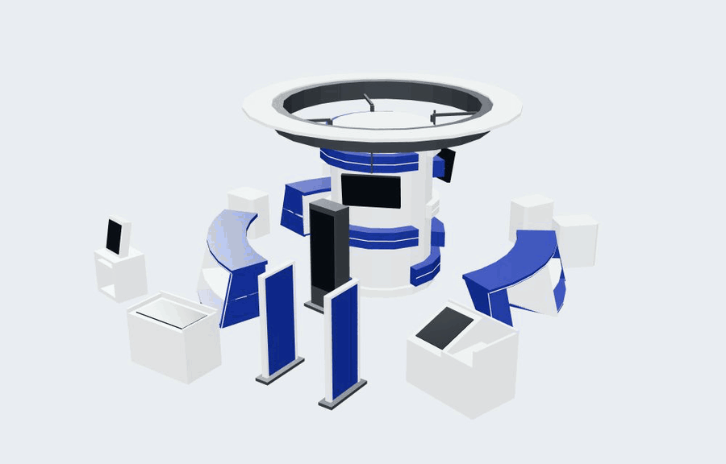
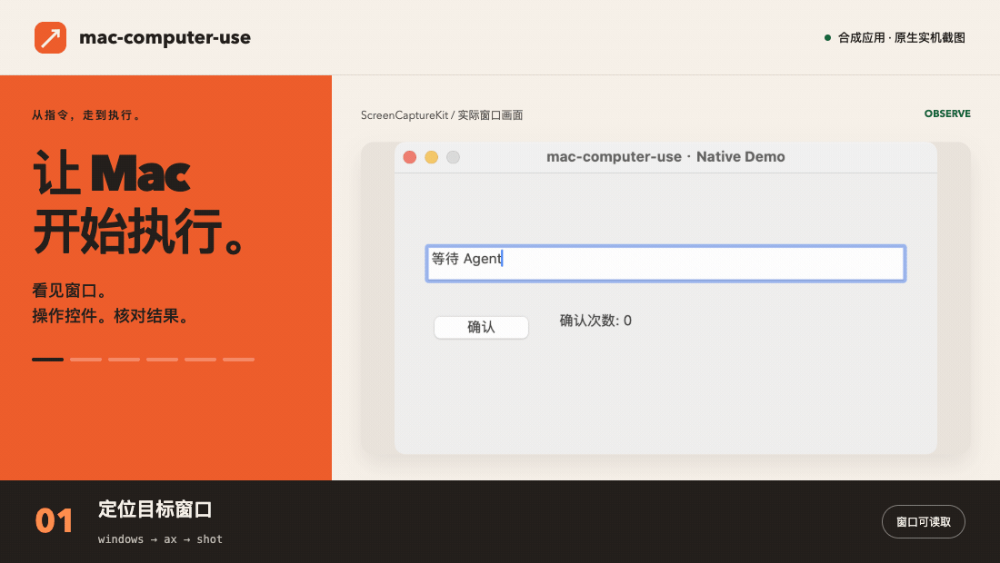
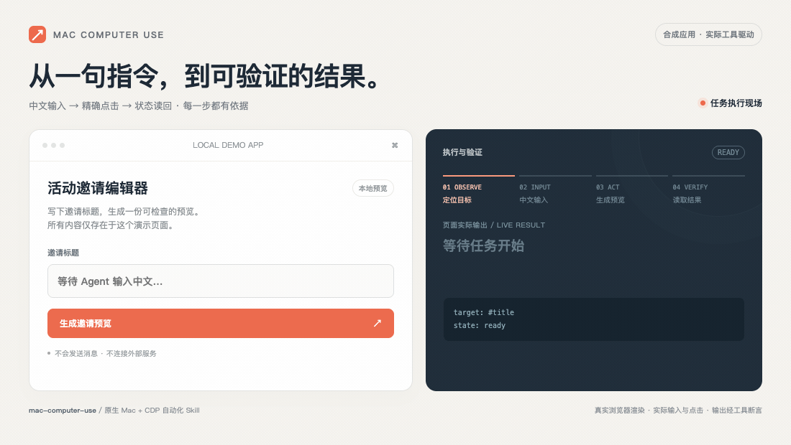

<div align="center">

# mac-computer-use

### 把 Mac 桌面，变成 Agent 的执行环境。

### 让 Agent 看见窗口、主动操控电脑，替你完成相应的操作。

[](https://github.com/To3akaRin/mac-computer-use/actions/workflows/ci.yml)
[](https://github.com/To3akaRin/mac-computer-use/releases)
[](LICENSE)
[](docs/acceptance.md)


**基于开放的 [Agent Skills 协议](https://agentskills.io/)。一份技能包，接入多种 Agent。**

Claude Code · Codex ·WorkBuddy · 豆包 · 千问 · Kimi Code · Cursor · OpenClaw · ZCode

### 全平台可用！ 

支持读取完整技能文件并执行 macOS 本机命令的 runtime 可接入；

具体安装方式与实测状态见 [兼容表](references/runtimes.md)。

[快速上手](#快速上手) · [核心能力](#核心能力) · [验收记录](docs/universal-v0.2.md) · [命令接口](API.md) · [下载](https://github.com/To3akaRin/mac-computer-use/releases/latest)

</div>

---

## 从参考照片，走到能旋转的 3D 展区，全程没有人碰鼠标，12 分钟。



**实战案例：中央展区 3D 建模。** 中央柱体、顶部圆环、弧形柜体、门架、终端和收银台，组成一个可以在浏览器中转动、检查的三维空间。

**3,388 个三角面 · 117 个网格 · 单文件 GLB 约 218 KiB。** 上图直接录自模型查看器，多角度展示实际几何。模型带有可编辑 Blender 源文件；尺寸依据参考照片估算。


[查看静态大图](assets/showcase-3d-poster.jpg) · [素材来源与录制说明](docs/media.md)

## 让自动化走进真正的桌面工作

打开应用、定位窗口、填写表单、点击确认、检查结果、截取证据——这些原本需要人守着屏幕完成的动作，现在可以交给 Agent 编排。

**mac-computer-use 给 Agent 一套直接操作 Mac 的执行工具。** 它把原生窗口、辅助功能树和内嵌 Chromium 页面连接到同一套工作流程：先观察目标，再选择通道，执行后验证结果。

没有现成 API 的桌面环节，也有机会接入自动化。只要 Agent 能读取 `SKILL.md` 并执行本地命令，就能使用这套工具；Codex 附带自动发现元数据，核心能力不绑定专属插件。

> **你负责提出目标，Agent 负责观察、操作和核对结果。**

## 直接这样交代 Agent

安装技能后，可以从这些任务开始。以下是任务示例，具体可执行范围取决于目标应用暴露的控件和接口。

```text
“给这个图片做成3d 建模。”

“帮我这个应用自动连接服务器完成部署，每一步都检查结果。”

“找到目标窗口，把这段中文填进指定输入框，再读回来核对。”

“点击这个按钮，检查应用状态是否真的改变，截一张结果图。”（全自动化测试可用！）

```

-
-
-
-
-


## 核心能力

| 能力 | 具体能做什么 |
| --- | --- |
| **看清目标** | 列出窗口、进程、标题和几何信息；读取 AX 控件；观察 CDP 页面结构。 |
| **找到入口** | 探测应用 bundle、脚本字典、URL scheme 和候选调试端口，帮助 Agent 选择控制通道。 |
| **输入到位** | AX 精确设值和读回；原生 Unicode 输入；CDP 通过 `Input.insertText` 写入输入框与富文本区域。 |
| **真正交互** | 原生点击、悬停、滚动、快捷键；CDP 渲染器鼠标和键盘事件。 |
| **受控接管** | 后台通道优先；需要前台时检查用户空闲、目标与互斥锁，操作后恢复原焦点。 |
| **准确定位** | 明确区分逻辑点、归一化坐标和截图像素；快照绑定窗口，过期或几何变化时拒绝执行。 |
| **拿出证据** | ScreenCaptureKit 窗口截图、AX 值读回、CDP 只读断言与结构化 JSON 结果。 |
| **连续执行** | CDP JSON 批处理；任何一步失败、拒绝或结果未知，立即停止后续步骤。 |

**控制工具在本机运行。原生内核使用系统框架，CDP 客户端零运行时 npm 依赖。** 不需要自建服务端、数据库或独立 API Key。


## 看 Agent 真正动手

### 原生 Mac：观察、输入、点击、读回



窗口画面由本项目原生工具实际截取，展示预演不改值、AX 中文写入、真实点击计数和键盘输入后的结果核对。外围阶段文案经过排版，播放节奏不作为耗时基准。[静态封面](assets/native-demo-poster.png)

### CDP：让一句指令走完输入、执行与验证



合成页面中的输入与点击由本项目 CDP 工具真实驱动：中文进入输入框，点击生成预览，最后读取页面结果并断言一致。[静态封面](assets/cdp-demo-poster.png)


## 把“操作过了”推进到“结果核对过了”

桌面自动化最难的部分，是确保动作落在正确目标上，并判断它究竟有没有生效。

这套工具把执行边界放进了实现：

- **执行前预演。** 写命令支持 `--dry-run`，检查参数和可用的前置条件，不实际输入、点击或重启。
- **定位有依据。** 元素必须明确，坐标单位必须明确；旧窗口引用和不唯一的目标会被拒绝。
- **使用前台有秩序。** 用户空闲至少 2 秒，最多等待 15 秒；前台操作使用会话锁，用户恢复输入时停止。
- **结果未知就停。** 写入后无法确认结果时返回 `unknown`，不切换通道盲目重放。
- **验证本身保持只读。** CDP 等待条件和断言拒绝副作用，避免“为了检查成功，又执行了一遍”。

Agent 得到的是可处理的 JSON：目标是谁、走了哪个通道、状态如何、证据在哪。对点击和按键，事件派发与业务完成明确区分；输入框文字正确，也不会被当成已经保存或发送。


**桌面内核已有 6 项 XCTest、15 项原生自检及 20 项 CDP 单测；v0.2.0 新增 14 项启动入口与 11 项安装打包测试。** 另已完成两套本机真实交互验收，以及无构建缓存的干净目录编译。

[查看 CI 验证](https://github.com/To3akaRin/mac-computer-use/actions/runs/34208441256) · [查看验收记录与兼容范围](docs/acceptance.md)

这些结果来自专用测试应用和隔离浏览器，不代表所有第三方应用都已验收。当前实机环境为 **macOS 15.7.7 / Apple Silicon / Swift 6.1.2**；Node.js **22.23.1 与 24.18.0** 已验证。最低目标为 macOS 14，Intel 与 macOS 14 实机矩阵待补充。


-
-
-
-
-


## 快速上手

需要 **macOS 14+、Swift 6 Command Line Tools**；CDP 另需 **Node.js 22.4+**。

```bash
# 已安装 Command Line Tools 时跳过这一行。
xcode-select --install

git clone https://github.com/To3akaRin/mac-computer-use.git
cd mac-computer-use
bash scripts/build.sh

.build/release/mac-computer-use doctor
.build/release/mac-computer-use help
node scripts/cdp.mjs --help
```

在系统设置 → 隐私与安全中，为启动工具的终端或 Agent 应用授予“辅助功能”和“屏幕与系统音频录制”（名称依系统版本不同）。授权后重启宿主并复查 `doctor`。工具不修改系统权限数据库。


## 所有 runtime 共用的启动方式

以下以 Codex 安装位置举例；`SKILL_DIR` 是本段命令中显式设置的局部变量，其他 runtime 换成其实际技能路径：

```bash
SKILL_DIR="$HOME/.codex/skills/mac-computer-use"
sh "$SKILL_DIR/scripts/run.sh" native doctor
sh "$SKILL_DIR/scripts/run.sh" native windows
sh "$SKILL_DIR/scripts/run.sh" cdp --help
```

原生模式检查 macOS 和 Swift 并增量构建；CDP 模式只检查 Node.js。入口支持中文、空格与符号链接路径，不切换调用者工作目录；相对截图路径仍指向你正在工作的项目。已有 `.build/release/mac-computer-use` 和 `node scripts/cdp.mjs` 用法继续有效。

## 跑通第一条原生观察流程

```bash
mkdir -p artifacts
.build/release/mac-computer-use probe --app com.apple.TextEdit
.build/release/mac-computer-use windows

# 将 12345 换成 windows 实际返回的目标窗口 id。
.build/release/mac-computer-use ax --window 12345 --snapshot-out artifacts/window.json
.build/release/mac-computer-use shot --window 12345 --output artifacts/window.png --snapshot-out artifacts/window-image.json
```

观察后再执行写操作。完整参数、预演和坐标说明见 [原生控制指南](references/native.md) 与 [命令接口](API.md)。

### 连接内嵌 Chromium 页面

目标应用需要实际支持并开放本地调试端口：

```bash
node scripts/cdp.mjs targets --endpoint http://127.0.0.1:9222
node scripts/cdp.mjs snapshot --endpoint http://127.0.0.1:9222 --target PAGE_ID
```

`PAGE_ID` 来自探测结果，端口使用目标应用的实际端口。客户端不会因为指定端口而自动重启应用。输入、断言与批处理示例见 [CDP 指南](references/cdp.md)。


贡献前阅读 [CONTRIBUTING.md](CONTRIBUTING.md)，行为变更同步接口、参考文档和 [CHANGELOG.md](CHANGELOG.md)。


## 开源协作

欢迎带着具体应用、明确场景和可复现证据参与：补充兼容性测试、改进元素定位、完善输入路径，让更多桌面工作进入 Agent 的执行范围。

**把目标交给 Agent，把执行落到桌面。**

MIT · Copyright (c) 2026 To3akaRin
